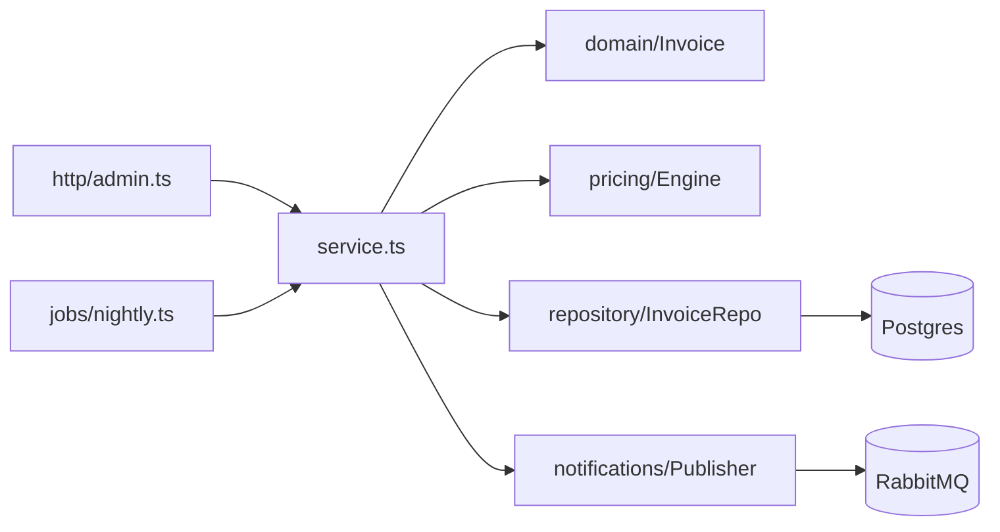

# Example: Analysis of a hypothetical `billing` module

This is a worked example showing the level of depth expected. Real reports should cite real file paths with line numbers.

---

# Analysis: billing

_Analyzed on 2026-04-18 at commit `a1b2c3d`. Scope: `src/billing/`._

## 1. Functional description

`billing` computes invoices for subscription customers at the end of each period, applies discounts and taxes, and emits invoice records to the persistence layer and a notification queue. It is triggered both on a nightly cron and on-demand via an admin endpoint.

## 2. Entry points

| Entry | Path | Role |
|---|---|---|
| `BillingService.runCycle()` | `src/billing/service.ts` | Orchestrates a full billing run |
| `POST /admin/billing/run` | `src/billing/http/admin.ts` | On-demand trigger |
| `nightlyBillingJob` | `src/billing/jobs/nightly.ts` | Cron trigger |

## 3. Decomposition

```
src/billing/
├── service.ts        # facade / orchestrator
├── http/             # HTTP boundary
├── jobs/             # scheduler boundary
├── domain/           # invoice, line-item, discount entities
├── repository/       # persistence
├── pricing/          # discount + tax rules
├── notifications/    # outbound events
└── util/             # skipped
```

Architectural style: layered with a thin DDD-ish `domain/` folder. `service.ts` is a facade.

## 4. Dependency skeleton



Notes:
- **Boundary**: `http/admin.ts`, `jobs/nightly.ts`, `service.ts`.
- **Core**: `domain/Invoice`, `pricing/Engine`.
- **External**: `pg`, `amqplib`.

## 5. Key components

### `BillingService` — `src/billing/service.ts`

**Role:** boundary / facade

| Name | Kind | Role |
|---|---|---|
| `runCycle(period)` | public method | Full billing run for a period |
| `runForCustomer(id)` | public method | On-demand run for one customer |
| `deps` | attribute (read) | Injected collaborators |

### `PricingEngine` — `src/billing/pricing/engine.ts`

**Role:** core

| Name | Kind | Role |
|---|---|---|
| `price(items, ctx)` | public method | Applies discount + tax rules |
| `rules` | attribute (read) | Rule set loaded at construction |

## 6. Patterns recognized

- **Facade** — `BillingService` hides the rest of the module from HTTP and job boundaries.
- **Rule engine** — `PricingEngine` iterates an array of `Rule` objects; adding a discount means adding a rule, not changing logic.
- **Repository** — all DB access is in `repository/`; domain entities are plain objects.
- **Outlier** — `src/billing/pricing/legacyVat.ts` uses direct SQL instead of the repository; likely pre-dates the refactor.

## 7. History anomalies

- `pricing/legacyVat.ts` introduced in `9f8e7d6` (2023-02-11): "temp: port old VAT rules until new engine lands". Never removed.

## 8. Tests as documentation

- `service.test.ts › runCycle › skips customers without active subscription` — defines the filter rule.
- `pricing/engine.test.ts › applies discounts before taxes` — documents rule ordering.
- `jobs/nightly.test.ts › retries on transient DB error` — documents retry policy.

## 9. Open questions / risks

- `legacyVat.ts` is a ticking bomb; unclear if still reachable.
- No integration test exercises the notification path end-to-end.
- `util/` was intentionally skipped.

## 10. Where to put the first debugger

`src/billing/service.ts:42` — top of `runCycle`. Stepping from here covers the full path for the common case.
