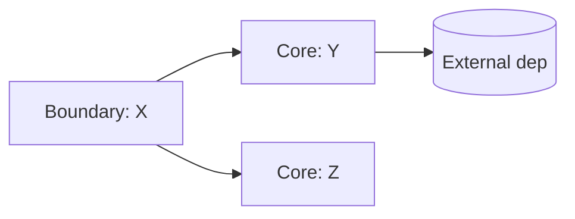

# Code Analysis Report Template

Use this template for the report. Keep each section skimmable; link to code rather than quoting large blocks.

```markdown
# Analysis: <module name>

_Analyzed on <YYYY-MM-DD> at commit <short-sha>. Scope: <path/to/module>._

## 1. Functional description

<2–4 sentences. What is this module for? Who uses it? What observable behavior does it produce?>

## 2. Entry points

| Entry | Path | Role |
|---|---|---|
| `<symbol or file>` | `path/to/file` | <one line> |

## 3. Decomposition

```
<module>/
├── <subfolder-a>/    # <role>
├── <subfolder-b>/    # <role>
└── <subfolder-c>/    # <skip: utils>
```

Architectural style: <MVC / layered / DDD / hexagonal / flat / unclear>.

## 4. Dependency skeleton



Notes:
- **Boundary** components: <list>
- **Core** components: <list>
- **External dependencies**: <list, with purpose>

## 5. Key components

### `<ComponentName>` — `path/to/file`

**Role:** boundary | core | value object | util

| Name | Kind | Role |
|---|---|---|
| `method1()` | public method | <one line> |
| `field1` | attribute (read/write) | <one line> |

<Repeat for 3–8 key components. Skip the rest.>

## 6. Patterns recognized

- **<Pattern name>** — seen in `<files>`. <One-line description.>
- **<Convention>** — e.g. "every handler has a matching DTO in `dto/`".
- **Outliers** — <code that breaks the pattern, with file:line>.

## 7. History anomalies

<Only fill in if anomalies were found. Cite commit SHAs.>

- `<file:line>` looks inconsistent; introduced in `<sha>`: "<commit message>".

## 8. Tests as documentation

Representative behaviors, taken from tests:

- `<test name>` (`path/to/test`) — <what it demonstrates>.
- `<test name>` (`path/to/test`) — <what it demonstrates>.

## 9. Open questions / risks

- <Things that were unclear and may bite a future developer.>
- <Areas deliberately skipped in this pass.>

## 10. Where to put the first debugger

If modifying this module, start reading from: `<file:line>`.
```
